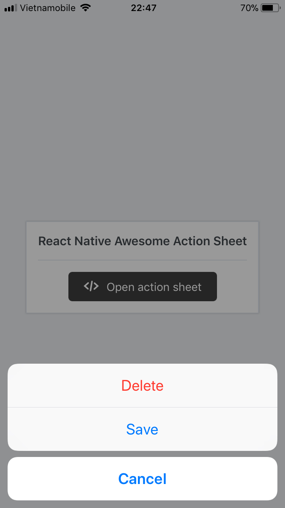
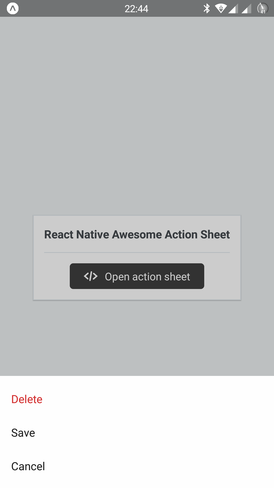

# react-native-awesome-action-sheet

ActionSheet is a cross-platform React Native component that uses the native UIActionSheet on iOS and a JS implementation with material design on Android. Almost a drop in replacement for [ActionSheetIOS](https://facebook.github.io/react-native/docs/actionsheetios.html) except it cannot be called statically.

This project is based on [react-native-action-sheet](https://github.com/expo/react-native-action-sheet) by [Expo](https://github.com/expo/).

 

## Installation

```
npm install react-native-awesome-action-sheet
```

Using Yarn:
```
yarn add react-native-awesome-action-sheet
```

## Usage

[See the example app source on Snack](https://snack.expo.io/BkYg9i9Gf)
